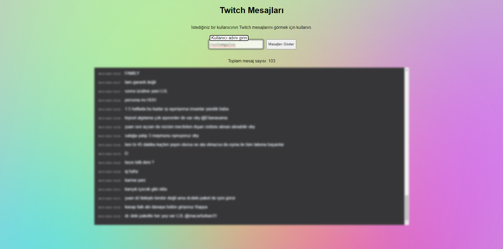
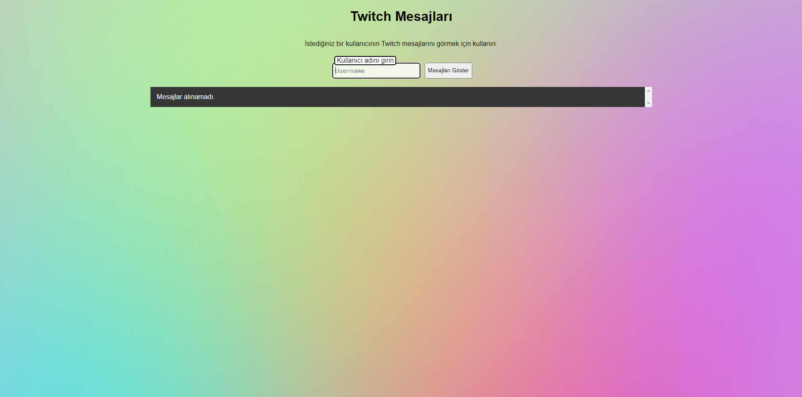

# TwitchChatLogger

## How to use

**Follow this steps**: 

#Open bot.js
##DD username, password(TOKEN), channels(if you want more channel: 'channel1', 'channel2')
#Open Terminal
##Install express and node server.js
#Open Second terminal
##node bot.js

